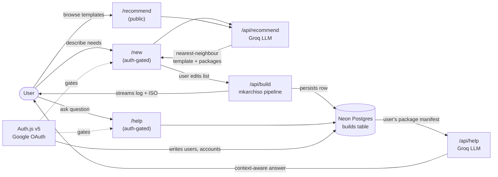
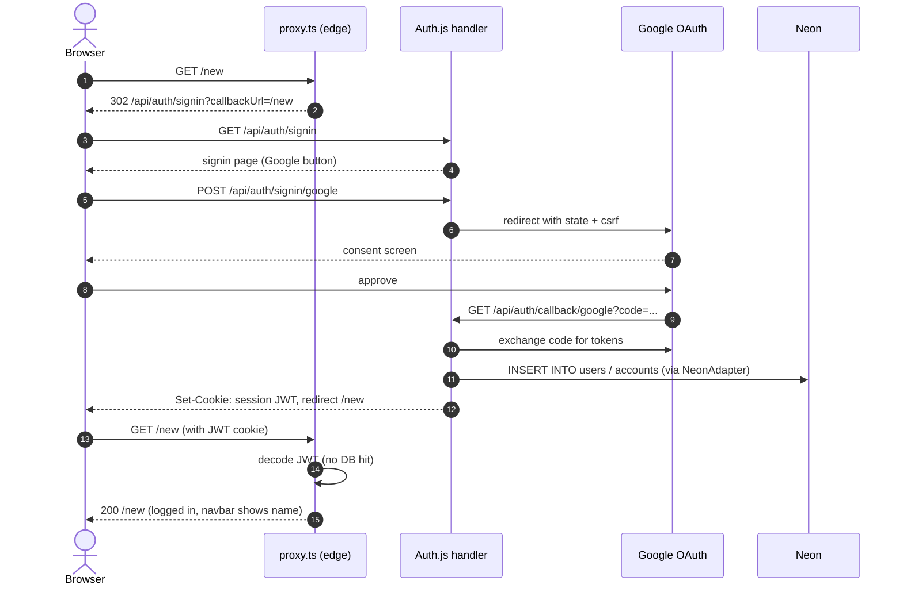
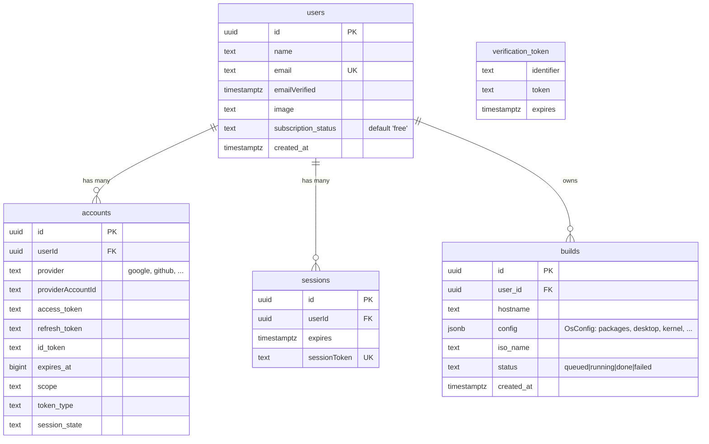

# Operate

> Describe your workflow and get a Linux distribution tailored exactly for you — pre-installed tools, tuned performance, ready to boot.

**Operate** generates custom Arch-based Linux ISOs from a natural-language description (or a guided form). An LLM picks the closest existing distro template, the user edits the package list, and `mkarchiso` builds a bootable image they can download.

Current version: **alphav1.0** — auth + DB + UI + build pipeline wired end-to-end.

---

## How it works



---

## Auth flow

OAuth via Google with JWT sessions. Adapter writes users/accounts to Neon so `builds.user_id` has a real FK target; sessions are stateless cookies so `proxy.ts` can validate without a DB hit on the edge runtime.



---

## Database schema

Four tables managed by the Auth.js Neon adapter, plus `builds` which is ours.



> `sessions` and `verification_token` are populated by Auth.js in some flows but are currently unused — JWT session strategy means the session cookie is self-contained. The tables stay because the adapter references them.

---

## Tech stack

| Layer       | Choice                                                        |
|-------------|---------------------------------------------------------------|
| Framework   | Next.js 16 (App Router, Turbopack)                            |
| UI          | React 19, Tailwind 4, daisyUI 5                               |
| Language    | TypeScript 5                                                  |
| Auth        | Auth.js v5 (`next-auth@beta`) + `@auth/neon-adapter`          |
| Database    | Neon Postgres via `@neondatabase/serverless`                  |
| LLM         | Groq (`groq-sdk`, currently `llama-3.3-70b-versatile`)        |
| ISO builder | `mkarchiso` (host-side, spawned from `/api/build`)            |
| Deployment  | Vercel                                                        |

---

## Getting started

### 1. Prerequisites
- Node 20+
- Postgres-compatible DB (we use Neon; any PG works)
- A Google OAuth client (see "Google OAuth setup" below)
- A Groq API key

### 2. Install
```bash
npm install
```

### 3. Environment variables
Create `.env.local`:

```bash
# DB
DATABASE_URL="postgresql://..."          # Neon pooled connection string

# Auth.js
AUTH_SECRET="..."                        # generate: openssl rand -base64 32
AUTH_GOOGLE_ID="...apps.googleusercontent.com"
AUTH_GOOGLE_SECRET="GOCSPX-..."

# LLM
GROQ_API_KEY="gsk_..."
```

### 4. Apply DB schema
```bash
psql "$DATABASE_URL" -f app/lib/db/schema.sql
```

### 5. Run
```bash
npm run dev
# http://localhost:3000
```

### Google OAuth setup
At https://console.cloud.google.com → APIs & Services → Credentials → OAuth client (Web app):
- **Authorized JavaScript origins:** `http://localhost:3000` (+ prod URL when deploying)
- **Authorized redirect URIs:** `http://localhost:3000/api/auth/callback/google`
- Fill the OAuth consent screen (External, Testing mode); add your email under Test users.

---

## Project structure

```
operatev1/
├── auth.ts               # Auth.js v5 full config (adapter + callbacks)
├── auth.config.ts        # Providers only — edge-safe slice imported by proxy.ts
├── proxy.ts              # Auth gate for /new and /help (Next 16 successor to middleware.ts)
├── app/
│   ├── layout.tsx
│   ├── page.tsx          # Landing
│   ├── new/              # /new — build a custom distro (auth-gated)
│   ├── help/             # /help — ask questions about your build (auth-gated, stub)
│   ├── recommend/        # /recommend — public template suggester (stub)
│   ├── api/
│   │   ├── auth/[...nextauth]/route.ts   # Auth.js catch-all
│   │   ├── recommend/                    # Groq nearest-neighbour
│   │   └── build/                        # mkarchiso pipeline
│   ├── components/
│   │   ├── navbar.tsx          # Server wrapper — calls auth()
│   │   └── navbar-client.tsx   # Client UI + session prop
│   └── lib/
│       ├── auth/actions.ts     # signIn/signOut server actions
│       ├── db/index.ts         # Neon Pool
│       ├── db/schema.sql       # DDL
│       └── os/                 # OsConfig types + mkarchiso wrappers
```

### Why split `auth.ts` and `auth.config.ts`?

`proxy.ts` runs on Vercel's Edge runtime. The Neon adapter pulls in code that Edge can't run, so importing the full `auth.ts` into `proxy.ts` would break. The split keeps the providers list edge-safe; the full config (with adapter) is only loaded server-side.

### Why JWT session strategy with an adapter?

Database sessions would require the proxy to query Neon on every request to validate the session token. JWT sessions are self-contained — the proxy decodes and verifies the cookie statelessly. The adapter still persists `users` and `accounts` to Neon on signin, which is what we need for `builds.user_id` to FK against.

---

## Roadmap

Sequenced for shortest-time-to-visible-value. Tracked in detail in the project journal.

1. **Editable package list on `/new`** — let the user `−` and `+ Add` packages after the recommendation.
2. **Help tab MVP** — list a user's builds, ask a question, LLM gets the package manifest as context.
3. **Nearest-neighbour prompt over a curated distro database** — replace free-form generation with "find the closest real distro, then pick from its package pool."
4. **Custom defaults on `/new`** — hostname/username/locale/timezone/keymap form fields.
5. **Update daemon (multi-week)** — daemon on the ISO + an "Update" button in the OS that applies server-pushed package/config changes. Requires per-build identity, a defined update payload format, rollback, and offline handling.
6. **Human tier (validate via Calendly first, don't build yet)** — paid tier for orgs/schools/AI-skeptics who'd rather have a person.

Parked: custom ricing on `/new` — waiting until the team has enough ricing taste to supervise the AI's output.

---

## Release convention

Tags follow `alphav<MAJOR>.<MINOR>` while pre-1.0:
- **MAJOR** bumps when a roadmap-level feature ships end-to-end.
- **MINOR** bumps for follow-on tightening of the same feature.

Released:
- **alphav1.0** (2026-05-17) — Auth.js v5 + Neon adapter, JWT sessions, navbar login/logout, `proxy.ts` gating, full DB schema; consolidates pre-existing build pipeline + UI rework.
